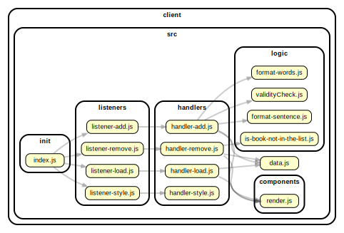

<!-- BEGIN TITLE -->

# DOCS

<!-- END TITLE -->

<!-- BEGIN TREE -->

> [interactive graph](./dependency-graph.html)

<!-- END TREE -->

<!-- BEGIN TOC -->

- public
  - assets
- src
  - components
    - [render.js](#clientsrccomponentsrenderjs)
  - handlers
    - [handler-add.js](#clientsrchandlershandler-addjs)
    - [handler-load.js](#clientsrchandlershandler-loadjs)
    - [handler-remove.js](#clientsrchandlershandler-removejs)
    - [handler-style.js](#clientsrchandlershandler-stylejs)
  - init
    - [index.js](#clientsrcinitindexjs)
  - listeners
    - [listener-add.js](#clientsrclistenerslistener-addjs)
    - [listener-load.js](#clientsrclistenerslistener-loadjs)
    - [listener-remove.js](#clientsrclistenerslistener-removejs)
    - [listener-style.js](#clientsrclistenerslistener-stylejs)
  - logic
    - [format-sentence.js](#clientsrclogicformat-sentencejs)
    - [format-words.js](#clientsrclogicformat-wordsjs)
    - [is-book-not-in-the-list.js](#clientsrclogicis-book-not-in-the-listjs)
    - [validityCheck.js](#clientsrclogicvalidityCheckjs)
  - [data.js](#clientsrcdatajs)
- styles

---

<!-- END TOC -->

<!-- BEGIN DOCS -->

# /public

## /assets

---

---

# /src

## /components

<a href="../../client/src/components/render.js" id="clientsrccomponentsrenderjs">../client/src/components/render.js</a>

---

## /handlers

<a href="../../client/src/handlers/handler-add.js" id="clientsrchandlershandler-addjs">../client/src/handlers/handler-add.js</a>

<a href="../../client/src/handlers/handler-load.js" id="clientsrchandlershandler-loadjs">../client/src/handlers/handler-load.js</a>

<a href="../../client/src/handlers/handler-remove.js" id="clientsrchandlershandler-removejs">../client/src/handlers/handler-remove.js</a>

<a href="../../client/src/handlers/handler-style.js" id="clientsrchandlershandler-stylejs">../client/src/handlers/handler-style.js</a>

---

## /init

<a href="../../client/src/init/index.js" id="clientsrcinitindexjs">../client/src/init/index.js</a>

---

## /listeners

<a href="../../client/src/listeners/listener-add.js" id="clientsrclistenerslistener-addjs">../client/src/listeners/listener-add.js</a>

<a href="../../client/src/listeners/listener-load.js" id="clientsrclistenerslistener-loadjs">../client/src/listeners/listener-load.js</a>

<a href="../../client/src/listeners/listener-remove.js" id="clientsrclistenerslistener-removejs">../client/src/listeners/listener-remove.js</a>

<a href="../../client/src/listeners/listener-style.js" id="clientsrclistenerslistener-stylejs">../client/src/listeners/listener-style.js</a>

---

## /logic

<a href="../../client/src/logic/format-sentence.js" id="clientsrclogicformat-sentencejs">../client/src/logic/format-sentence.js</a>

## formatSentence ⇒ <code>string</code>

Given a string input, the function will delete all space characters from the end and
begin of the string. Then, if there are more than 1 space characters between
words, it will delete all extra spaces. Lastly, it will make first letter of sentence
uppercase.

**Returns**: <code>string</code> - - Returns a formatted string.

| Param     | Type                | Description           |
| --------- | ------------------- | --------------------- |
| userInput | <code>string</code> | The string to format. |

<a href="../../client/src/logic/format-words.js" id="clientsrclogicformat-wordsjs">../client/src/logic/format-words.js</a>

## formatWords ⇒ <code>string</code>

Given a string input, the function will delete all space characters from the end and
begin of the string. Then, if there are more than 1 space characters between
words, it will delete all extra spaces. Lastly, it will make first letter of words
uppercase and other letters lowercase.

**Returns**: <code>string</code> - - Returns a formatted string.

| Param     | Type                | Description           |
| --------- | ------------------- | --------------------- |
| userInput | <code>string</code> | The string to format. |

<a href="../../client/src/logic/is-book-not-in-the-list.js" id="clientsrclogicis-book-not-in-the-listjs">../client/src/logic/is-book-not-in-the-list.js</a>

## isBookNotInTheList ⇒ <code>boolean</code>

Creates a boolean value after checking whether given book name is not in the array.
If the book title is not in the array, it returns true. Otherwise, false.

**Returns**: <code>boolean</code> - - Returns a boolean value of true/false.

| Param         | Type               | Description                      |
| ------------- | ------------------ | -------------------------------- |
| arrayBookList | <code>Array</code> | The array of objects to inspect. |
| toRemove      | <code>any</code>   | The value to check.              |

<a href="../../client/src/logic/validityCheck.js" id="clientsrclogicvalidityCheckjs">../client/src/logic/validityCheck.js</a>

## validityCheck ⇒ <code>boolean</code>

Check whether given parameter have at least 2 characters after space characters are removed
If parameter length is less than 2, it return true. Otherwise, false.

**Returns**: <code>boolean</code> - - Returns a boolean value of true/false.

| Param     | Type                | Description              |
| --------- | ------------------- | ------------------------ |
| userInput | <code>string</code> | The user input to check. |

---

<a href="../../client/src/data.js" id="clientsrcdatajs">../client/src/data.js</a>

---

# /styles

---

<!-- END DOCS -->
